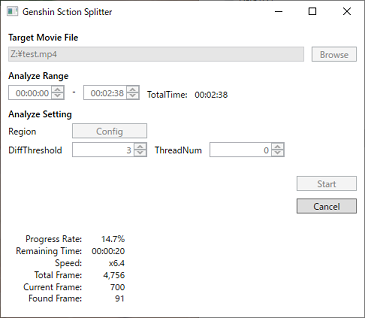

# Genshin Time Splitter

This application is designed for elite enemies TA in "Genshin Impact" by HoYoVerse,  
analyzing videos and outputting csv/json/xspf files segmented by loading screen times.  
You can calculate time efficiency per elite enemy using the output files.  

## Download / Install

[GenshinTimeSplitter_x64.zip Latest Version](https://github.com/saipan-fez/GenshinTimeSplitter/releases/latest/download/GenshinTimeSplitter_x64.zip)

1. Download from the link above
1. Extract the downloaded zip file to any folder

> To uninstall, please delete the folder.

## Tutorial Video

TODO

## How to Use

!!! warning "Important"
    Due to the mechanics of this app, please use videos with as high a bitrate as possible for analysis.  
    Using low bitrate videos may significantly increase the chances of incorrect detection results.  

    **Recommended Video Settings**  
    Resolution: 1920x1080  
    Frame rate: 30fps  
    Bitrate: At least 10Mbps  

!!! Note
    If your video falls under the following conditions, settings adjustments are required at [[Analyze Setting] -> Region](#region):  
    ・The video has black bars at the top, bottom, left, or right (outside the game screen)  
    ・The game screen has overlays such as timers  

### Application Usage Instructions

1. Select the video to analyze using the [Browse] button.
1. Adjust the video timing to analyze with `Analyze Range`.
1. Change the settings in `Analyze Setting` (see below).
1. Press the [Start] button.

Results are outputted in the same folder as the video file.  
For how to use the output files, see the section "Example of Using Output Files" below.  

### Analyze Settings

#### Region

The area analyzed as the loading screen.  
**If there are black bars above, below, or on the sides of the video (outside the game screen)**  
**If there are overlays such as timers displayed on the game screen**  
In such cases, you must adjust the area that is recognized as the loading screen.  

The area to be set is either completely white or completely black.

- [Good Examples](./img/setting_region_OK.drawio.png)
- [Bad Examples](./img/setting_region_NG.drawio.png)

#### DiffThreshold

The threshold for recognizing loading screens.  
Increasing this value can allow detection even in low bitrate videos.  
However, it increases the chance of false detections, so we recommended not to change it.  

#### TheadNum

The number of threads to use for analysis.  
If "0", all CPU cores will be used.  
Generally, there is no need to change it.  

### Examples of Using Output Files

1. Open the csv file with a spreadsheet tool like Excel
1. Open the xspf file with a video player like [VLC MediaPlayer](https://www.videolan.org/vlc/)
1. Manually record the number of elite enemies defeated while seeking through the video from the playlist
1. Calculate the time efficiency per elite defeated based on the time and number of elites defeated per segment

!!! NOTE
    xspf file is a playlist file.

## Planned Features

- Splitting at the moment the map is opened

## License

[MIT License](https://github.com/saipan-fez/GenshinTimeSplitter/blob/main/LICENSE)

This project is not affiliated with HoYoVerse.
Genshin Impact, game content and materials are trademarks and copyrights of HoYoVerse.
