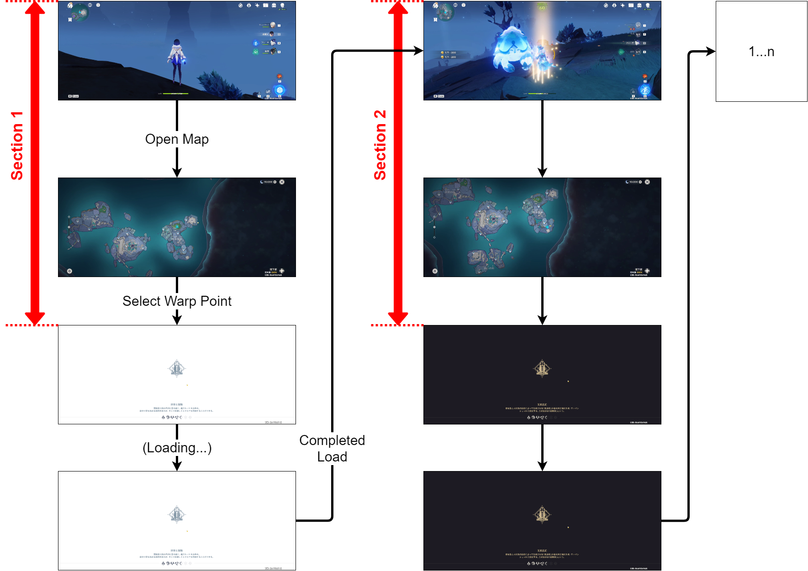

# 仕組み

精鋭狩りではその性質上、  
**戦闘→マップを開いて次のワープを選択→ロード**  
を繰り返し行う。
そして、それを撮影した動画ファイルの各フレームは以下のように分類できる。

- マップ画面
- ロード画面
    1. 背景が白色 - #FFFFFF
    2. 背景が黒色 - #1D1B23
    3. 全面真っ黒 - #000000  
       → キャラクター位置とワープポイントが非常に近い場合のみ表示される
- それ以外
    - 戦闘
    - アイテム画面など

上記を利用し、動画ファイルの各フレームがロード画面かどうかを判別し、  
それを時間軸で並べることで下記の画像のように「セクション」という単位で動画ファイルのフレームを区切る。  
なお、ロード画面の表示時間（ロード時間）は移動するワープ距離などによって大きく変動するため、  
セクションにはロード時間は含まないようにする。

## ロード画面の判別方法

`Analyze Region` で設定した位置の色を取得し、  
ロード画面1～3の色で塗りつぶされているかどうかで判別する。
そのため、画質が悪い場合や設定した位置が

## 課題

現在の仕組みではマップ画面の時間が各セクションに含まれる。  
これを避けるためには各フレームがマップ画面かを解析することで実現できる。  
しかし、マップ画面の解析には下記のような制約があるため、  
OBSから現在表示しているフレームをリアルタイムに取得する方法での実現を検討する。  
これには現在から大幅な変更が必要なため、次verでの実装とする。

**[制約]**  
マップ画面かどうかの判別は下記でしか行えない。

- 右上の閉じるボタン
- 左下のオプションボタン
- 右下の都市移動ボタン

いずれも非常に領域が狭いため、正確な位置を計算する必要があるが、  
動画解像度とゲーム解像度が異なる場合、ゲーム画面が縮小されたり、  
上下・左右に黒帯が入ったりすることがある。  
このような場合、位置がずれてしまうため位置計算が非常に難しい。
