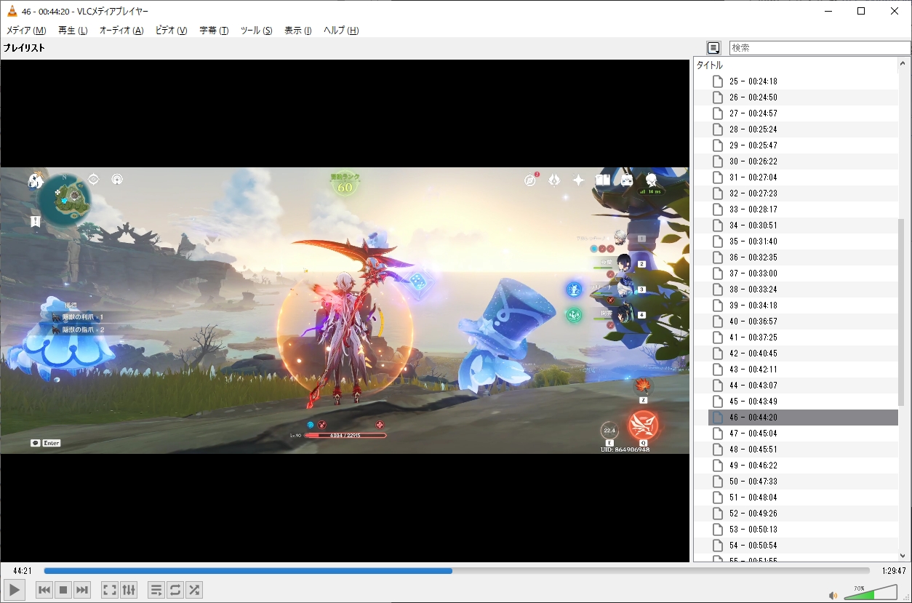

# 出力ファイル

## 使用例

1. csvファイルをExcelなどの表計算ツールで開く
1. xspfファイルを動画プレイヤーで開く
1. プレイリストから動画をシークしながら倒した精鋭数を手動でExcelファイルに記録する
1. 区間ごとの時間と倒した精鋭数から、精鋭1体当たりの時間効率を求める

## 各ファイルの仕様

### CSVファイル

各列の仕様は下記の通りです。  
 
|列名|説明|
|:-|:-|
|no|シーケンス番号(1から順に採番)|
|section_start|セクションが開始した動画内時間|
|load_start|ロード画面が表示された動画内時間|
|seconds_from_section_start_to_load_start|セクション開始からロード画面表示までの時間(秒)|
|seconds_from_section_start_to_load_end|セクション開始からロード画面終了までの時間(秒)|

### XSPFファイル

XML形式のプレイリストファイルです。  
[VLC MediaPlayer](https://www.videolan.org/vlc/) などの動画プレイヤーで開けます。  

VLC MediaPlayer で下記のよう設定することでスムーズに精鋭の集計が行えます。  

1. メニュー [表示] から下記を設定
    1. [プレイリスト] でプレイリストを表示
    1. [プレイリストの表示モード] で「詳細リスト」を選択
    1. [プレイリストをドッキング] を「ON」にする

設定を反映した例

### JSONファイル

各Keyの仕様は下記の通りです。  

|Key|説明|
|:-|:-|
|AnalyzeStartTimeSpan|アプリ内 `Analyze Range` で指定した開始時間|
|AnalyzeEndTimeSpan|アプリ内 `Analyze Range` で指定した終了時間|
|Sections||
|　No|シーケンス番号(1から順に採番)|
|　SectionStartedTimeSpan|セクションが開始した動画内時間|
|　MapOpenedTimeSpan|(reserved)always null|
|　LoadScreenStartedTimeSpan|ロード画面が表示された動画内時間|
|　LoadScreenFinishedTimeSpan|ロード画面が消えた動画内時間|
|　SecondsFromSectionStartToLoadScreenStarted|セクション開始からロード画面表示までの時間(秒)|
|　SecondsFromSectionStartToLoadScreenFinished|セクション開始からロード画面終了までの時間(秒)|
